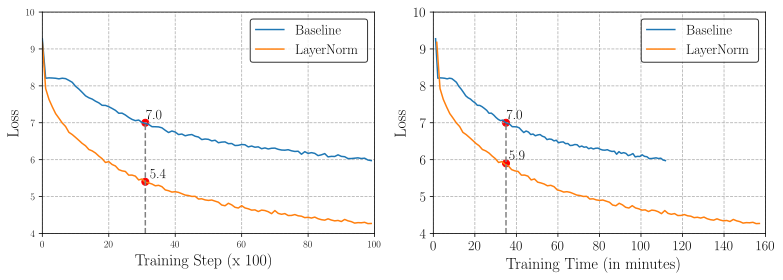
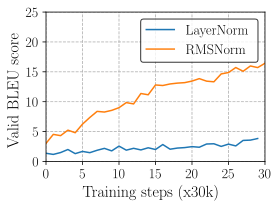

# RMSNorm
short for `Root Mean Square Layer Normalization`


[RMSNorm](https://openreview.net/pdf?id=SygkZ3MTJE) is a simplification of the original layer normalization 
([LayerNorm](https://arxiv.org/abs/1607.06450)).
LayerNorm is a regularization technique that might handle the `internal covariate shift` issue so as to 
stabilize the layer activations and improve model convergence.
It has been proved quite successful in NLP-based model. In some cases, 
LayerNorm has become an essential component to enable model optimization, such as in the SOTA NMT model `Transformer`.

One application of LayerNorm is on recurrent neural networks. Nonetheless, we observe that 
LayerNorm raises computational overhead per running step, 
which diminishes the net efficiency gain from faster and more stable training, as shown in the Figure below.

<p align="center">
  
  <em>Training procedure of a GRU-based RNNSearch for the first 10k training steps. Baseline means the original 
  model without any normalization. When the Baseline training loss arrives at 7.0, the loss of LayerNorm 
  reaches 5.4 after the same number of training steps (left figure), but only 5.9 after the same training 
  time (right figure).</em>
</p>

RMSNorm simplifies LayerNorm by removing the mean-centering operation, or normalizing layer activations with RMS
statistic:

<a href="https://www.codecogs.com/eqnedit.php?latex=\begin{align}&space;\begin{split}&space;&&space;\bar{a}_i&space;=&space;\frac{a_i}{\text{RMS}(\mathbf{a})}&space;g_i,&space;\quad&space;\text{where}~~&space;\text{RMS}(\mathbf{a})&space;=&space;\sqrt{\frac{1}{n}&space;\sum_{i=1}^{n}&space;a_i^2}.&space;\end{split}\nonumber&space;\end{align}" target="_blank"></a>


When the mean of the inputs is exactly 0, then LayerNorm equals to RMSNorm. We also observe that the RMS statistic 
can be estimated from partial inputs, based on the iid assumption. Below shows the comparision of LayerNorm 
 and RMSNorm in different properties.

|            | Weight matrix re-scaling | Weight matrix re-centering | Weight Vector re-scaling | Dataset re-scaling | Dataset re-centering | Single training case re-scaling |
|:----------:|:------------------------:|:--------------------------:|:------------------------:|:------------------:|:--------------------:|:-------------------------------:|
|  BatchNorm |          &#9745;         |           &#9746;          |          &#9745;         |       &#9745;      |        &#9745;       |             &#9746;             |
| WeightNorm |          &#9745;         |           &#9746;          |          &#9745;         |       &#9746;      |        &#9746;       |             &#9746;             |
|  LayerNorm |          &#9745;         |           &#9745;          |          &#9746;         |       &#9745;      |        &#9746;       |             &#9745;             |
|   RMSNorm  |          &#9745;         |           &#9746;          |          &#9746;         |       &#9745;      |        &#9746;       |             &#9745;             |
| *p*RMSNorm |          &#9745;         |           &#9746;          |          &#9746;         |       &#9745;      |        &#9746;       |             &#9745;             | 

As RMSNorm does not consider the mean of the inputs, it's not re-centering invariant. This is the main difference
compared to LayerNorm.

But, *does it matter abandoning the re-centering invariant property?* or *does the re-centering invariant property help
improve the robustness of LayerNorm?* We did an experiment on RNNSearch with *[Nematus](https://github.com/EdinburghNLP/nematus)*,
where we initialize the weights with a center of about 0.2. The figure below suggests that removing re-centering operation
in RMSNorm does not hurt its stability.

<p align="center">
  
  <em>SacreBLEU score curve of LayerNorm and RMSNorm on newstest2013 (devset) when the initialization center is 0.2.</em>
</p>

## Requirements
The codes rely on the following packages:
* Python2.7
* Numpy
* Tensorflow
* Theano
* Scipy
* lasagne

## General codes
We provide separate code:
- `layers.py`: This is used for Theano-related experiments.
- `rmsnorm_tensorflow/torch.py`: an implementation for Tensorflow or Pytorch use.

## Experiments
We did experiments on four different tasks, including different neural models (RNN/CNN/Transformer), 
different non-linear activations (linear/sigmoid/tanh/relu), different weight initializations(normal/uniform/orthogonal), 
and different deep learning frameworks (Theano/Pytorch/Tensorflow). Our experiments involve NLP-related and Image-related tasks.
Most of the settings follows those in LayerNorm paper. But from our view, we put more focus on machine translation.

### Machine Translation
The machine translation experiments are based on *[Nematus(v0.3)](https://github.com/EdinburghNLP/nematus/tree/v0.3)*. To run 
experiments with RMSNorm:
- clone the github repository and checkout the specific version. 
    ```
    git clone https://github.com/EdinburghNLP/nematus.git
    cd nematus
    git checkout tags/v0.3   
    ```
- change the implementation of `LayerNormLayer` in `layers.py` as follows:
    ```
    class LayerNormLayer(object):
        def __init__(self,
                     layer_size,
                     eps=1e-5):
            # TODO: If nematus_compat is true, then eps must be 1e-5!
            self.new_std = tf.get_variable('new_std', [layer_size],
                                           initializer=tf.constant_initializer(1))
            self.eps = eps
            self.layer_size = layer_size
    
        def forward(self, x):
            # m, v = tf.nn.moments(x, axes=[-1], keep_dims=True)
            # std = tf.sqrt(v + self.eps)
            # norm_x = (x-m)/std
            # new_x = norm_x*self.new_std + self.new_mean
            # return new_x
            ms = tf.reduce_sum(tf.square(x), axis=-1,
                               keep_dims=True) * 1./self.layer_size
    
            norm_inputs = x * tf.rsqrt(ms + self.eps)
            return norm_inputs * self.new_std
    ```
- train your model following the instructions in Nematus, such as [wmt17_systems](http://data.statmt.org/wmt17_systems/training/).

To ease the training of RNNSearch, we also provide the used/preprocessed [dataset & training script & pretrained model](
http://data.statmt.org/bzhang/neurips19_rmsnorm/).

* About the Theano-experiments: You can download the Theano-version [Nematus](https://github.com/EdinburghNLP/nematus/tree/theano)
You need chang the `layer_norm` function in `layers.py` as follows:
    ```
    def layer_norm(x, b, s):
        _eps = numpy_floatX(1e-5)
        norm_x = tensor.mean(x * x, axis=-1, keepdims=True)
        output = x / tensor.sqrt(norm_x + _eps)
    
        if x.ndim == 3:
            output = s[None, None, :] * output + b[None, None,:]
        else:
            output = s[None, :] * output + b[None,:]
        return output
    ```
Of course, `b` here is deletable. The training follows a similar way as above.

### CNN/Daily Mail Reading Comprehension

We experiment with the bidirectional attentive reader model proposed by Hermann et al. 
We use the attentive reader model from the repository given by [Tim Coojimans et al.](https://github.com/cooijmanstim/Attentive_reader/tree/bn).

Please follow the steps below:

* Clone the above repository and obtain the data:
    ```
    wget http://www.cs.toronto.edu/~rkiros/top4.zip
    ```    
* In codes/att_reader/pkl_data_iterator.py set vdir to be the directory you unzipped the data
* Add the RMSNorm function to `layers.py` in `codes/att_reader/layers.py`
* Add the *rlnlstm_layer* and *param_init_rlnlstm* functions to `layers.py` in `codes/att_reader/layers.py`
* Add 'rlnlstm': ('param_init_rlnlstm', 'rlnlstm_layer'), to `layers`
* Follow the instructions for training a new model

We train the model using the following command

    GPUARRAY_FORCE_CUDA_DRIVER_LOAD=True THEANO_FLAGS=mode=FAST_RUN,floatX=float32,device=$device,gpuarray.preallocate=0.8 python -u train_attentive_reader.py \
        --use_dq_sims 1 --use_desc_skip_c_g 0 --dim 240 --learn_h0 1 --lr 8e-5 --truncate -1 --model "lstm_s1.npz" --batch_size 64 --optimizer "adam" --validFreq 1000 --model_dir $MDIR --use_desc_skip_c_g 1  --unit_type rlnlstm --use_bidir 1

Below are the log files from the model trained using RMSNorm:

    wget http://data.statmt.org/bzhang/neurips19_rmsnorm/attentive_reader/stats_lstm_s1.npz.pkl

### Image-Caption Retrieval

We experiment with order-embedding model proposed by Vendro et al. The code used is available [here](https://github.com/ivendrov/order-embedding). 

Please follow the steps below:

* Clone the above repository
* Add the RMSNorm function to `layers.py` in the order-embeddings repo
* Add the *rlngru_layer* and *param_init_rlngru* functions to `layers.py` in the order-embeddings repo
* Add 'rlngru': ('param_init_rlngru', 'rlngru_layer'), to `layers`
* In `driver.py`, replace 'encoder': 'gru' with 'encoder': 'rlngru'
* Follow the instructons on the main page to train a model

Available below is a download to the model used to report results in the paper:
    
    wget http://data.statmt.org/bzhang/neurips19_rmsnorm/oe/order.npz
    wget http://data.statmt.org/bzhang/neurips19_rmsnorm/oe/order.pkl

Once downloaded, follow the instructions on the main page for evaluating models. Notice that
please change the prefix for `rlngru` model to `lngru` to use the saved models.

### CIFAR-10 Classification

We experiment with the ConvPool-CNN-C architecture proposed by Krizhevsky and Hinton, and follow the settings in WeightNorm.
We use the implementation [here](https://github.com/TimSalimans/weight_norm).

Please follow the steps below:

* Clone the above repository
* Add RMSNorm function to `nn.py` as follows:
    ```
    class RMSNormLayer(lasagne.layers.Layer):
        def __init__(self, incoming, b=lasagne.init.Constant(0.), g=lasagne.init.Constant(1.),
                     W=lasagne.init.Normal(0.05), nonlinearity=relu, **kwargs):
            super(RMSNormLayer, self).__init__(incoming, **kwargs)
            self.nonlinearity = nonlinearity
            k = self.input_shape[1]
            if b is not None:
                self.b = self.add_param(b, (k,), name="b", regularizable=False)
            if g is not None:
                self.g = self.add_param(g, (k,), name="g")
    
            if len(self.input_shape)==4:
                self.axes_to_sum = (2,3)
                self.dimshuffle_args = ['x',0,'x','x']
            else:
                self.axes_to_sum = 1
                self.dimshuffle_args = ['x',0]
    
        def get_output_for(self, input, **kwargs):
            meanS = T.mean(input ** 2,axis=self.axes_to_sum,keepdims=True)
    
            norm_input = input / T.sqrt(meanS + 1e-6)
    
            if hasattr(self, 'g'):
                activation = norm_input*self.g.dimshuffle(*self.dimshuffle_args)
            else:
                activation = norm_input
            if hasattr(self, 'b'):
                activation += self.b.dimshuffle(*self.dimshuffle_args)
    
            return self.nonlinearity(activation)
    
    def rms_norm(layer, b=lasagne.init.Constant(0.), g=lasagne.init.Constant(1.), **kwargs):
        nonlinearity = getattr(layer, 'nonlinearity', None)
        if nonlinearity is not None:
            layer.nonlinearity = lasagne.nonlinearities.identity
        if hasattr(layer, 'b'):
            del layer.params[layer.b]
            layer.b = None
        return RMSNormLayer(layer, b, g, nonlinearity=nonlinearity, **kwargs)
    ```
* Add the option into `train.py`:
    ```
    elif args.norm_type=='rms_norm':
        normalizer = lambda l: nn.rms_norm(l)
    ```
* Download the ciFar dataset and set the train/test_data direction in `train.py` to your ciFar directory
    
        wget https://www.cs.toronto.edu/~kriz/cifar-10-python.tar.gz

We use the following command to train the model:

    GPUARRAY_FORCE_CUDA_DRIVER_LOAD=True THEANO_FLAGS=mode=FAST_RUN,floatX=float32,device=$device,gpuarray.preallocate=0.4 python train.py --norm_type rms_norm --learning_rate 0.003

Running los of our model can be downloaded as below:

    wget http://data.statmt.org/bzhang/neurips19_rmsnorm/cifar/results.csv

## Citation

If you find the codes useful, please consider cite the following paper:
> Biao Zhang; Rico Sennrich (2019). Root Mean Square Layer Normalization. In Advances in Neural Information Processing Systems 32. Vancouver, Canada.
```
@inproceedings{zhang-sennrich-neurips19,
    address = "Vancouver, Canada",
    author = "Zhang, Biao and Sennrich, Rico",
    booktitle = "Advances in Neural Information Processing Systems 32",
    url = "https://openreview.net/references/pdf?id=S1qBAf6rr",
    title = "{Root Mean Square Layer Normalization}",
    year = "2019"
}
```

Please feel free to contact [me](mailto:B.Zhang@ed.ac.uk) for any questions about our paper.